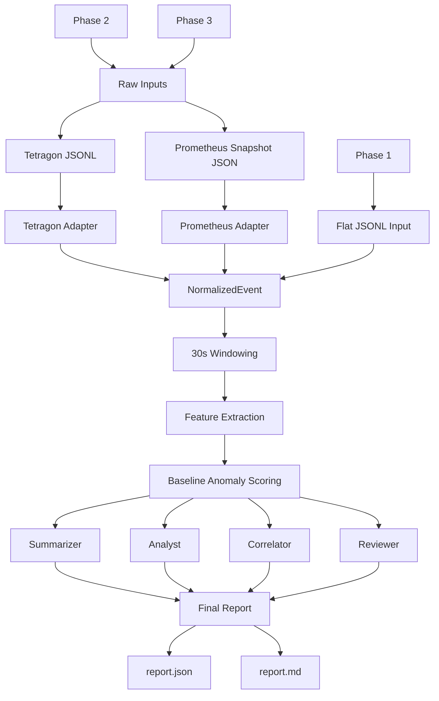

# eBPF ML MAO

`eBPF + ML` 기반 운영 분석 시스템을 `멀티 에이전트 오케스트레이션` 방식으로 설계하고 구현하는 저장소입니다.

이 저장소는 설계 문서, 단계별 구현 기록, Python MVP 코드, 샘플 입력, 배포 매니페스트를 함께 관리합니다.

## What This Repo Covers

- eBPF 이벤트 수집 기반 운영 관측
- ML 추론을 포함한 이상 징후 분석 흐름
- 여러 에이전트가 역할을 나눠 협업하는 오케스트레이션 구조
- Kubernetes 배포 및 정책 실험용 YAML

## Pipeline Overview



## Repository Layout

```text
.
├── app/          # Python MVP 구현체
├── deploy/       # Kubernetes/Tetragon 배포 파일
├── docs/         # 설계, 스펙, 단계 문서
├── samples/      # phase별 샘플 입력
├── tests/        # unittest 기반 검증
└── README.md
```

## Key Documents

- [`docs/architecture/MAO/Architecture.md`](./docs/architecture/MAO/Architecture.md): 멀티 에이전트 오케스트레이션 아키텍처
- [`docs/architecture/MAO/Agent.md`](./docs/architecture/MAO/Agent.md): 에이전트 역할 분리와 운영 메모
- [`docs/architecture/ebpf-ml-mao/README.md`](./docs/architecture/ebpf-ml-mao/README.md): eBPF + ML 청사진 문서 묶음 개요
- [`docs/architecture/ebpf-ml-mao/04-mvp-scope.md`](./docs/architecture/ebpf-ml-mao/04-mvp-scope.md): MVP 범위 정리
- [`docs/steps/step6/README.md`](./docs/steps/step6/README.md): 현재 최신 구현 단계 문서
- [`deploy/yaml/tetragon-tracingpolicy.yaml`](./deploy/yaml/tetragon-tracingpolicy.yaml): Tetragon 정책 실험 예시
- [`docs/architecture/MAO/Orchestrator-Playbook.md`](./docs/architecture/MAO/Orchestrator-Playbook.md): 오케스트레이터 운영 규칙
- [`docs/architecture/MAO/Order-Templates.md`](./docs/architecture/MAO/Order-Templates.md): 에이전트별 오더 템플릿
- [`docs/architecture/MAO/Execution-Protocol.md`](./docs/architecture/MAO/Execution-Protocol.md): 단계별 실행 프로토콜

## Current Focus

현재 기준으로 이 저장소의 중심은 아래 네 축입니다.

1. eBPF 이벤트를 어떤 형태로 수집하고 표준화할지 정의
2. 수집 데이터를 ML 추론과 연결할 처리 흐름 설계
3. live ingestion 기반으로 실제 입력 경로를 붙이는 것
4. 설계, 구현, 검증을 에이전트별로 분리해 병렬 작업 구조를 만드는 것

## How To Use

- 설계 흐름을 먼저 보려면 `docs/architecture/MAO/`부터 읽는 것이 좋습니다.
- eBPF + ML 기능 범위를 보려면 `docs/architecture/ebpf-ml-mao/` 문서를 보면 됩니다.
- 구현 진행 기록은 `docs/steps/` 아래 문서를 보면 됩니다.
- 배포/정책 실험은 `deploy/yaml/` 아래 파일을 기준으로 진행하면 됩니다.

## Notes

- 현재는 문서와 MVP 구현이 함께 있는 저장소입니다.
- `docs/specs/spec.txt`에는 환경 메모가 포함되어 있어 공개 범위는 계속 점검하는 편이 안전합니다.
- 로컬 실행 부산물은 `.gitignore`로 제외되어 있습니다.
